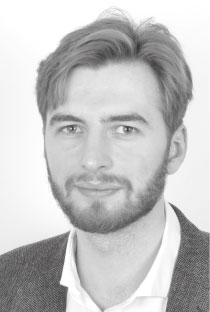

# Frédéric LAUSSON

## Objectif
Accepté à la __Normandie Web School__ en première année préparatoire, 

j'ai pu réaliser deux stages qui ont confirmé mon projet professionnel. 

Confiant dans la réussite de ce projet je recherche une 

__alternance au rythme de 3 semaines en entreprise/1 semaine école__.  

## Qualités

| Soft  | Hard | langues |
| ------------- |:-------------:|-------------:|
|    Curiosité   | HTML / CSS     |Anglais   | 
|    Bon relationnel   | Wordpress, Elementor     |Allemand   |
|    Rigueur   | llustrator, inDesign    |

## Expériences
* __2021 Aout__ - Stage Azulika : Réalisation de deux sites internet de A à Z, 

 création et édition d'une plaquette pour un salon.

* __2021  Juin__ - Stage Normandie Web School : Réalisation d'un script InDesign 

 pour automatiser la création de fiches programmes avec l'outil de DataMerge.

* __2016__ - Réalisation d'un site pour le compte d'une doctorante :  

 aider les médecins généralistes à mieux accompagner un patient atteint  

  de diabète de type 2 avec un questionnaire en ligne.

## Formations
* __2020-2021__ - Design Thinking, UX Design - Openclassrooms
* __2015-2017__ - L1 Sciences de la Vie et de la Terre
* __2013-2015__ - Première année de médecine (PACES)
* __2013__ - Baccalauréat scientifique, section européenne anglais/allemand

## Contact
53, rue de Lecat, Rouen 76000

Né le 15/06/1995

permis B

06 38 49 02 15

frederic.lausson.sailer@gmail.com
